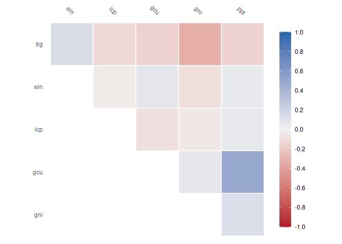
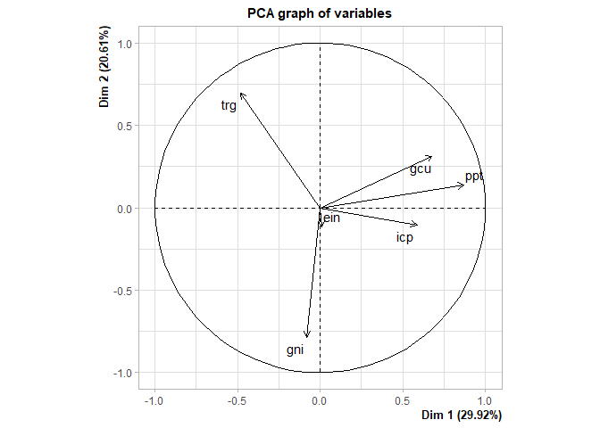

<!-- README.md is generated from README.Rmd. Please edit that file -->

# tidymodlr

<!-- badges: start -->

[](https://lifecycle.r-lib.org/articles/stages.html#experimental)
[](https://CRAN.R-project.org/package=tidymodlr)

<!-- badges: end -->

The goal of tidymodlr is to …

## Installation

You can install the development version of tidymodlr from
[GitHub](https://github.com/) with:

``` r
# install.packages("devtools")
devtools::install_github("david-hammond/tidymodlr")
```

## Example

This is a basic example which shows you how to solve a common problem
with long data:

``` r
library(tidymodlr)
data(wb)
head(wb)
#> # A tibble: 6 × 4
#>   iso3c indicator          year    value
#>   <chr> <chr>             <dbl>    <dbl>
#> 1 DZA   Population, total  2012 37260563
#> 2 DZA   Population, total  2011 36543541
#> 3 DZA   Population, total  2010 35856344
#> 4 AGO   Population, total  2012 25188292
#> 5 AGO   Population, total  2011 24259111
#> 6 AGO   Population, total  2010 23364185
```

Here you can see that the format is not conducive to regression or other
types of analysis that require wide formats. The indicator names are
also long, making pivot_longer result in cumbersome column names. To
assist, we build a tidymodl:

``` r
mdl <- tidymodl$new(wb,
                   pivot_column = "indicator",
                  pivot_value = "value")
print(mdl)
#> Key: 
#>   key                             indicator
#> 1 ein Energy imports, net (% of energy use)
#> 2 gcu                     GDP (current US$)
#> 3 gni                            Gini index
#> 4 icp Inflation, consumer prices (annual %)
#> 5 ppt                     Population, total
#> 6 trg                      Trade (% of GDP)
#> Matrix: 
#> # A tibble: 5 × 6
#>     ein           gcu   gni   icp      ppt   trg
#>   <dbl>         <dbl> <dbl> <dbl>    <dbl> <dbl>
#> 1 -213. 227143746076.  NA    8.89 37260563  60.8
#> 2 -249. 218331946925.  27.6  4.52 36543541  62.2
#> 3 -275. 177785053940.  NA    3.91 35856344  63.5
#> 4 -590. 128052915766.  NA   10.3  25188292  91.8
#> 5 -619. 111789747671.  NA   13.5  24259111 100.
```

This can now be used for regressions

``` r
### Use mdl$child for modelling
fit <- lm(data = mdl$child, gni ~ gcu + ppt)
summary(fit)
#> 
#> Call:
#> lm(formula = gni ~ gcu + ppt, data = mdl$child)
#> 
#> Residuals:
#>     Min      1Q  Median      3Q     Max 
#> -11.128  -5.515   1.219   4.132  24.701 
#> 
#> Coefficients:
#>               Estimate Std. Error t value Pr(>|t|)    
#> (Intercept)  3.959e+01  1.438e+00  27.523   <2e-16 ***
#> gcu          3.055e-12  9.031e-12   0.338    0.737    
#> ppt         -4.177e-08  3.828e-08  -1.091    0.282    
#> ---
#> Signif. codes:  0 '***' 0.001 '**' 0.01 '*' 0.05 '.' 0.1 ' ' 1
#> 
#> Residual standard error: 7.589 on 41 degrees of freedom
#>   (163 observations deleted due to missingness)
#> Multiple R-squared:  0.03422,    Adjusted R-squared:  -0.01289 
#> F-statistic: 0.7264 on 2 and 41 DF,  p-value: 0.4898
```

We can calculate and visualise correlations:

``` r
#In built xgboost imputation function
mdl$correlate()
#> Key: 
#>   key                             indicator
#> 1 ein Energy imports, net (% of energy use)
#> 2 gcu                     GDP (current US$)
#> 3 gni                            Gini index
#> 4 icp Inflation, consumer prices (annual %)
#> 5 ppt                     Population, total
#> 6 trg                      Trade (% of GDP)
#> Correlation computed with
#> • Method: 'pearson'
#> • Missing treated using: 'pairwise.complete.obs'
```



    #> # A tibble: 6 × 7
    #>   term      ein     gcu     gni     icp     ppt     trg
    #>   <chr>   <dbl>   <dbl>   <dbl>   <dbl>   <dbl>   <dbl>
    #> 1 ein   NA      -0.161  -0.123   0.0364  0.0805 -0.0568
    #> 2 gcu   -0.161  NA      -0.0786  0.0810  0.526  -0.0676
    #> 3 gni   -0.123  -0.0786 NA      -0.216  -0.178  -0.367 
    #> 4 icp    0.0364  0.0810 -0.216  NA       0.341  -0.231 
    #> 5 ppt    0.0805  0.526  -0.178   0.341  NA      -0.364 
    #> 6 trg   -0.0568 -0.0676 -0.367  -0.231  -0.364  NA

We can also perform principal component analysis:

``` r
# In built principal components analysis function
tmp <- mdl$pca()
#> Warning in PCA(self$child, graph = FALSE): Missing values are imputed by the
#> mean of the variable: you should use the imputePCA function of the missMDA
#> package
plot(tmp, choix = "var")
```



We can also append any data to the original data frame so long as the
`newdata` is either:

- A vector where `length(newdata) = nrow(mdl$child)`
- A marix/dataframe where
  `identical(dim(newdata), dim(mdl$child)) == TRUE`

``` r

### Can be used to add a yhat value for processed data

nc <- ncol(mdl$child)
nr <- nrow(mdl$child)
dm <- nc * nr
dummy <- matrix(runif(dm),
                ncol = nc) |>
                data.frame()
names(dummy) = names(mdl$child)
tmp <- mdl$assemble(dummy)
head(tmp)
#> # A tibble: 6 × 5
#>   iso3c indicator                              year    value  yhat
#>   <chr> <chr>                                 <dbl>    <dbl> <dbl>
#> 1 DZA   Energy imports, net (% of energy use)  2012 -2.13e 2 0.541
#> 2 DZA   GDP (current US$)                      2012  2.27e11 0.220
#> 3 DZA   Gini index                             2012 NA       0.952
#> 4 DZA   Inflation, consumer prices (annual %)  2012  8.89e 0 0.638
#> 5 DZA   Population, total                      2012  3.73e 7 0.382
#> 6 DZA   Trade (% of GDP)                       2012  6.08e 1 0.223
### This is useful for imputation purposes as below
```
