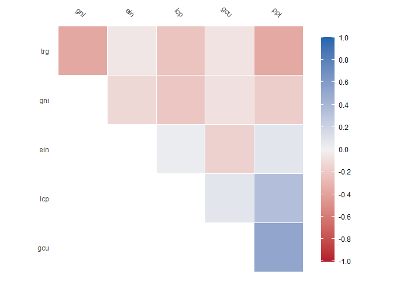

<!-- README.md is generated from README.Rmd. Please edit that file -->

# tidymodlr

<!-- badges: start -->

[](https://lifecycle.r-lib.org/articles/stages.html#experimental)
[](https://CRAN.R-project.org/package=tidymodlr)

<!-- badges: end -->

The goal of tidymodlr is to …

## Installation

You can install the development version of tidymodlr from
[GitHub](https://github.com/) with:

``` r
# install.packages("devtools")
devtools::install_github("david-hammond/tidymodlr")
```

## Example

This is a basic example which shows you how to solve a common problem
with long data:

``` r
library(tidymodlr)
data(wb)
head(wb)
#> # A tibble: 6 × 4
#>   iso3c indicator          year    value
#>   <chr> <chr>             <dbl>    <dbl>
#> 1 AFG   Population, total  2012 30466479
#> 2 AFG   Population, total  2011 29249157
#> 3 AFG   Population, total  2010 28189672
#> 4 ALB   Population, total  2012  2900401
#> 5 ALB   Population, total  2011  2905195
#> 6 ALB   Population, total  2010  2913021
```

Here you can see that the format is not conducive to regression or other
types of analysis that require wide formats. The indicator names are
also long, making pivot_longer result in cumbersome column names. To
assist, we build a tidymodl:

``` r
mdl <- tidymodl$new(wb,
                   pivot_column = "indicator",
                  pivot_value = "value")
print(mdl)
#> Key: 
#>   key                             indicator
#> 1 ein Energy imports, net (% of energy use)
#> 2 gcu                     GDP (current US$)
#> 3 gni                            Gini index
#> 4 icp Inflation, consumer prices (annual %)
#> 5 ppt                     Population, total
#> 6 trg                      Trade (% of GDP)
#> Matrix: 
#> # A tibble: 5 × 6
#>     ein          gcu   gni   icp      ppt   trg
#>   <dbl>        <dbl> <dbl> <dbl>    <dbl> <dbl>
#> 1  NA   19907329778.    NA  6.44 30466479  NA  
#> 2  NA   17805098206.    NA 11.8  29249157  NA  
#> 3  NA   15856668556.    NA  2.18 28189672  NA  
#> 4  16.3 12319834195.    29  2.03  2900401  76.5
#> 5  33.3 12890760315.    NA  3.43  2905195  81.2
```

This can now be used for regressions

``` r
### Use mdl$child for modelling
fit <- lm(data = mdl$child, gni ~ gcu + ppt)
summary(fit)
#> 
#> Call:
#> lm(formula = gni ~ gcu + ppt, data = mdl$child)
#> 
#> Residuals:
#>     Min      1Q  Median      3Q     Max 
#> -11.625  -5.824  -1.688   4.949  27.141 
#> 
#> Coefficients:
#>              Estimate Std. Error t value Pr(>|t|)    
#> (Intercept) 3.598e+01  5.183e-01  69.424   <2e-16 ***
#> gcu         8.101e-15  2.879e-13   0.028    0.978    
#> ppt         5.235e-09  3.325e-09   1.575    0.117    
#> ---
#> Signif. codes:  0 '***' 0.001 '**' 0.01 '*' 0.05 '.' 0.1 ' ' 1
#> 
#> Residual standard error: 7.62 on 244 degrees of freedom
#>   (404 observations deleted due to missingness)
#> Multiple R-squared:  0.01423,    Adjusted R-squared:  0.006147 
#> F-statistic: 1.761 on 2 and 244 DF,  p-value: 0.1741
```

We can calculate and visualise correlations:

``` r
#In built xgboost imputation function
mdl$correlate()
#> Key: 
#>   key                             indicator
#> 1 ein Energy imports, net (% of energy use)
#> 2 gcu                     GDP (current US$)
#> 3 gni                            Gini index
#> 4 icp Inflation, consumer prices (annual %)
#> 5 ppt                     Population, total
#> 6 trg                      Trade (% of GDP)
#> Correlation computed with
#> • Method: 'pearson'
#> • Missing treated using: 'pairwise.complete.obs'
```



    #> # A tibble: 6 × 7
    #>   term      ein     gcu     gni     icp     ppt    trg
    #>   <chr>   <dbl>   <dbl>   <dbl>   <dbl>   <dbl>  <dbl>
    #> 1 ein   NA       0.0703 -0.0939 -0.0355  0.0434  0.132
    #> 2 gcu    0.0703 NA       0.0649 -0.0879  0.492  -0.156
    #> 3 gni   -0.0939  0.0649 NA      -0.0467  0.119  -0.332
    #> 4 icp   -0.0355 -0.0879 -0.0467 NA       0.0557 -0.119
    #> 5 ppt    0.0434  0.492   0.119   0.0557 NA      -0.154
    #> 6 trg    0.132  -0.156  -0.332  -0.119  -0.154  NA

We can also impute using xgbBoost:

``` r
#In built xgboost imputation function
tmp <- mdl$xgb_impute()
head(tmp)
#> # A tibble: 6 × 5
#>   iso3c indicator                              year    value      yhat
#>   <chr> <chr>                                 <dbl>    <dbl>     <dbl>
#> 1 AFG   Energy imports, net (% of energy use)  2012 NA       -1.09e- 1
#> 2 AFG   GDP (current US$)                      2012  1.99e10  1.99e+10
#> 3 AFG   Gini index                             2012 NA        4.34e+ 1
#> 4 AFG   Inflation, consumer prices (annual %)  2012  6.44e 0  6.44e+ 0
#> 5 AFG   Population, total                      2012  3.05e 7  3.05e+ 7
#> 6 AFG   Trade (% of GDP)                       2012 NA        5.52e+ 1
```

We can also perform principal component analysis:

``` r
# In built principal components analysis function
tmp <- mdl$pca()
plot(tmp, choix = "var")
```


We can also append any data to the original data frame so long as the
`newdata` is either:

- A vector where `length(newdata) = nrow(mdl$child)`
- A marix/dataframe where
  `identical(dim(newdata), dim(mdl$child)) == TRUE`

``` r

### Can be used to add a yhat value for processed data

nc <- ncol(mdl$child)
nr <- nrow(mdl$child)
dm <- nc * nr
dummy <- matrix(runif(dm),
                ncol = nc) |>
                data.frame()
names(dummy) = names(mdl$child)
tmp <- mdl$assemble(dummy)
head(tmp)
#> # A tibble: 6 × 5
#>   iso3c indicator                              year    value   yhat
#>   <chr> <chr>                                 <dbl>    <dbl>  <dbl>
#> 1 AFG   Energy imports, net (% of energy use)  2012 NA       0.0335
#> 2 AFG   GDP (current US$)                      2012  1.99e10 0.400 
#> 3 AFG   Gini index                             2012 NA       0.683 
#> 4 AFG   Inflation, consumer prices (annual %)  2012  6.44e 0 0.702 
#> 5 AFG   Population, total                      2012  3.05e 7 0.203 
#> 6 AFG   Trade (% of GDP)                       2012 NA       0.288
### This is useful for imputation purposes as below
```
